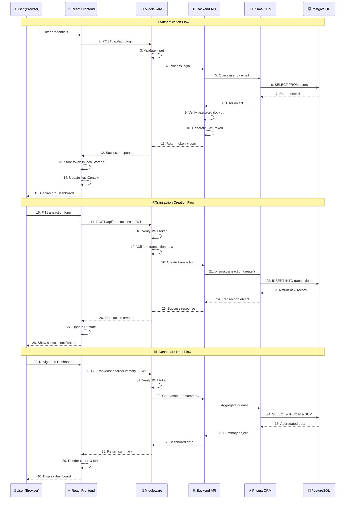
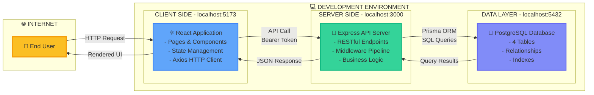
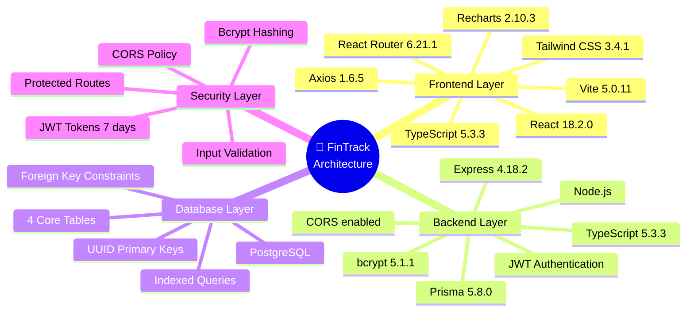
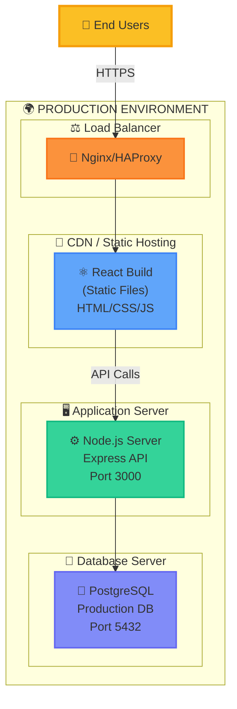
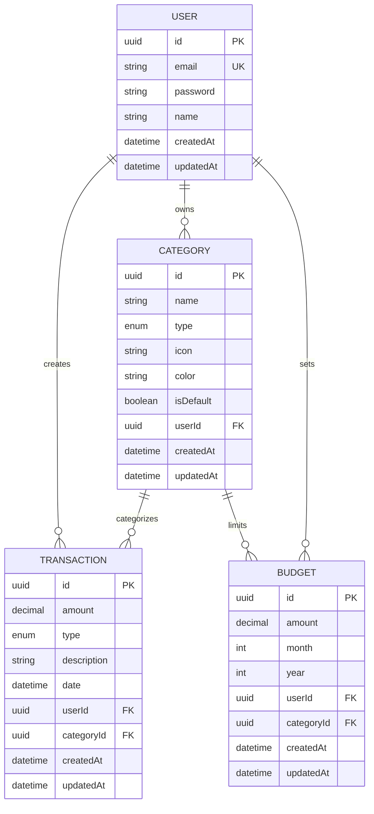

# FinTrack - System Architecture Diagram

## Cloud Network Architecture

```mermaid
%%{init: {'theme':'base', 'themeVariables': { 'primaryColor':'#0ea5e9','primaryTextColor':'#fff','primaryBorderColor':'#0284c7','lineColor':'#64748b','secondaryColor':'#f0f9ff','tertiaryColor':'#e0f2fe'}}}%%

graph TB
    subgraph CLOUD["☁️ CLOUD NETWORK"]

        subgraph CLIENTS["👥 CLIENT DEVICES"]
            Browser["💻 BROWSER<br/>(Chrome/Firefox/Safari)"]
            Mobile["📱 MOBILE<br/>(iOS/Android)"]
        end

        subgraph INFRA["🔧 INFRASTRUCTURE LAYER"]
            Vite["⚡ Vite Dev Server<br/>Port 5173"]
            Express["🚀 Express Server<br/>Port 3000"]
        end

        subgraph FRONTEND["🎨 FRONTEND SERVICES"]
            React["⚛️ React App<br/>(TypeScript)"]
            Router["🔀 React Router<br/>(Navigation)"]
            Context["📦 Auth Context<br/>(State Management)"]
            Components["🧩 UI Components<br/>(Tailwind CSS)"]
        end

        subgraph MIDDLEWARE["🔐 MIDDLEWARE LAYER"]
            CORS["🌐 CORS<br/>(Cross-Origin)"]
            Auth["🔑 JWT Auth<br/>(Token Verification)"]
            Validation["✅ Validation<br/>(Input Check)"]
        end

        subgraph BACKEND["⚙️ BACKEND SERVICES"]
            AuthAPI["🔐 Auth Service<br/>(Register/Login)"]
            TransAPI["💰 Transaction Service<br/>(CRUD Operations)"]
            CatAPI["📂 Category Service<br/>(Manage Categories)"]
            BudgetAPI["💳 Budget Service<br/>(Budget Planning)"]
            DashAPI["📊 Dashboard Service<br/>(Analytics)"]
        end

        subgraph DATABASE["🗄️ DATABASE SERVICES"]
            Prisma["⚡ Prisma ORM<br/>(Database Client)"]

            subgraph POSTGRES["🐘 PostgreSQL"]
                UserDB[("👤 Users Table")]
                CategoryDB[("📁 Categories Table")]
                TransDB[("💵 Transactions Table")]
                BudgetDB[("💰 Budgets Table")]
            end
        end

        subgraph SECURITY["🛡️ SECURITY LAYER"]
            JWT["🎫 JWT Tokens<br/>(7-day expiration)"]
            Bcrypt["🔒 Bcrypt<br/>(Password Hashing)"]
            LocalStorage["💾 LocalStorage<br/>(Token Persistence)"]
        end

    end

    %% Client Connections
    Browser -->|HTTP/HTTPS| Vite
    Mobile -->|HTTP/HTTPS| Vite

    %% Frontend Flow
    Vite -->|Serves| React
    React --> Router
    React --> Context
    React --> Components

    %% API Communication
    Context -->|"REST API<br/>(Axios + JWT)"| Express
    Components -->|API Calls| Express

    %% Middleware Layer
    Express --> CORS
    CORS --> Auth
    Auth --> Validation

    %% Backend Services
    Validation --> AuthAPI
    Validation --> TransAPI
    Validation --> CatAPI
    Validation --> BudgetAPI
    Validation --> DashAPI

    %% Security Integration
    Auth -.->|Verify| JWT
    AuthAPI -.->|Generate| JWT
    AuthAPI -.->|Hash| Bcrypt
    Context -.->|Store/Retrieve| LocalStorage

    %% Database Connections
    AuthAPI --> Prisma
    TransAPI --> Prisma
    CatAPI --> Prisma
    BudgetAPI --> Prisma
    DashAPI --> Prisma

    %% Database Tables
    Prisma -->|Query| UserDB
    Prisma -->|Query| CategoryDB
    Prisma -->|Query| TransDB
    Prisma -->|Query| BudgetDB

    %% Table Relationships
    UserDB -.->|"1:N"| TransDB
    UserDB -.->|"1:N"| CategoryDB
    UserDB -.->|"1:N"| BudgetDB
    CategoryDB -.->|"1:N"| TransDB
    CategoryDB -.->|"1:N"| BudgetDB

    classDef clientStyle fill:#fbbf24,stroke:#f59e0b,stroke-width:3px,color:#000
    classDef frontendStyle fill:#60a5fa,stroke:#3b82f6,stroke-width:2px,color:#fff
    classDef backendStyle fill:#34d399,stroke:#10b981,stroke-width:2px,color:#000
    classDef databaseStyle fill:#818cf8,stroke:#6366f1,stroke-width:2px,color:#fff
    classDef securityStyle fill:#f87171,stroke:#ef4444,stroke-width:2px,color:#fff
    classDef middlewareStyle fill:#fb923c,stroke:#f97316,stroke-width:2px,color:#fff

    class Browser,Mobile clientStyle
    class React,Router,Context,Components,Vite frontendStyle
    class AuthAPI,TransAPI,CatAPI,BudgetAPI,DashAPI,Express backendStyle
    class Prisma,UserDB,CategoryDB,TransDB,BudgetDB,POSTGRES databaseStyle
    class JWT,Bcrypt,LocalStorage securityStyle
    class CORS,Auth,Validation middlewareStyle
```



---

## Detailed Component Breakdown

### 📱 CLIENT LAYER
| Component | Technology | Port | Purpose |
|-----------|-----------|------|---------|
| **Browser** | Chrome, Firefox, Safari | - | Web access for desktop users |
| **Mobile** | iOS, Android (Future) | - | Mobile app access |

### 🎨 FRONTEND SERVICES
| Component | Technology | Purpose |
|-----------|-----------|---------|
| **React App** | React 18 + TypeScript | Main UI framework |
| **React Router** | v6.21.1 | Client-side routing |
| **Auth Context** | React Context API | Global authentication state |
| **UI Components** | Tailwind CSS | Reusable styled components |
| **Vite Dev Server** | Vite 5.0.11 | Development server (Port 5173) |

### 🔐 MIDDLEWARE LAYER
| Component | Technology | Purpose |
|-----------|-----------|---------|
| **CORS** | cors package | Handle cross-origin requests |
| **JWT Auth** | jsonwebtoken | Verify authentication tokens |
| **Validation** | express-validator | Validate request data |

### ⚙️ BACKEND SERVICES
| Service | Endpoint | Purpose |
|---------|----------|---------|
| **Auth Service** | `/api/auth` | User registration & login |
| **Transaction Service** | `/api/transactions` | CRUD for financial transactions |
| **Category Service** | `/api/categories` | Manage income/expense categories |
| **Budget Service** | `/api/budgets` | Monthly budget management |
| **Dashboard Service** | `/api/dashboard` | Analytics and summary data |

### 🗄️ DATABASE LAYER
| Component | Technology | Purpose |
|-----------|-----------|---------|
| **Prisma ORM** | Prisma 5.8.0 | Type-safe database client |
| **PostgreSQL** | PostgreSQL | Relational database |
| **Users Table** | UUID Primary Key | User accounts & credentials |
| **Categories Table** | UUID Primary Key | Income/Expense categories |
| **Transactions Table** | UUID Primary Key | Financial transactions |
| **Budgets Table** | UUID Primary Key | Monthly budget limits |

### 🛡️ SECURITY LAYER
| Component | Technology | Purpose |
|-----------|-----------|---------|
| **JWT Tokens** | jsonwebtoken | Authentication (7-day expiration) |
| **Bcrypt** | bcrypt | Password hashing (salt rounds) |
| **LocalStorage** | Browser API | Token persistence on client |

---

## 🔄 Request Flow Diagram



---

## 🌐 Network Flow



---

## 📊 Technology Stack Overview



---

## 🔑 Key Features

### ✅ Implemented Features

| Feature | Frontend | Backend | Database |
|---------|----------|---------|----------|
| 🔐 **User Authentication** | Login/Register Forms | JWT + bcrypt | Users table |
| 💰 **Transactions** | CRUD UI + Filters | RESTful API | Transactions table |
| 📂 **Categories** | Dropdown Selector | Category Management | Categories table |
| 💳 **Budgets** | Budget Setting Forms | Monthly Limits | Budgets table |
| 📊 **Dashboard** | Charts + Summary Cards | Analytics API | Aggregated Queries |
| 🔒 **Security** | Private Routes + Token Storage | JWT Middleware | Hashed Passwords |
| ✅ **Validation** | Form Validation (React Hook Form) | express-validator | DB Constraints |

---

## 🚀 Deployment Architecture



---

## 📝 API Endpoints Summary

### 🔐 Authentication (`/api/auth`)
```
POST   /api/auth/register          Register new user
POST   /api/auth/login             Login existing user
GET    /api/auth/me                Get current user profile (Protected)
```

### 💰 Transactions (`/api/transactions`)
```
GET    /api/transactions           List all transactions (Protected)
GET    /api/transactions/:id       Get single transaction (Protected)
POST   /api/transactions           Create new transaction (Protected)
PUT    /api/transactions/:id       Update transaction (Protected)
DELETE /api/transactions/:id       Delete transaction (Protected)
```

### 📂 Categories (`/api/categories`)
```
GET    /api/categories             List categories (Protected)
POST   /api/categories             Create category (Protected)
PUT    /api/categories/:id         Update category (Protected)
DELETE /api/categories/:id         Delete category (Protected)
```

### 💳 Budgets (`/api/budgets`)
```
GET    /api/budgets                List budgets with spending (Protected)
POST   /api/budgets                Create/Update budget (Protected)
DELETE /api/budgets/:id            Delete budget (Protected)
```

### 📊 Dashboard (`/api/dashboard`)
```
GET    /api/dashboard/summary      Monthly income/expense summary (Protected)
GET    /api/dashboard/chart        Category breakdown chart data (Protected)
GET    /api/dashboard/recent       Recent transactions list (Protected)
```

---

## 🔗 Database Relationships



---

## 📈 System Statistics

| Metric | Value |
|--------|-------|
| **Total Components** | 15+ React Components |
| **API Endpoints** | 18 RESTful Endpoints |
| **Database Tables** | 4 Core Tables |
| **Frontend Routes** | 6 Main Routes |
| **Middleware** | 3 Custom Middleware |
| **Services** | 5 Backend Services |
| **Type Safety** | 100% TypeScript |
| **Authentication** | JWT (7-day expiration) |

---

## 🎯 Project Goals

✅ **Completed:**
- Full-stack personal finance management system
- User authentication with JWT
- Transaction tracking (Income/Expense)
- Category management
- Budget planning
- Dashboard analytics with charts
- Responsive UI with Tailwind CSS

🔜 **Future Enhancements:**
- Mobile app (React Native)
- Export data (CSV/PDF)
- Recurring transactions
- Multi-currency support
- Bill reminders
- Financial reports
- Data visualization improvements

---

**Generated:** 2025-12-10
**Project:** FinTrack - Personal Finance Management
**Version:** 1.0.0
